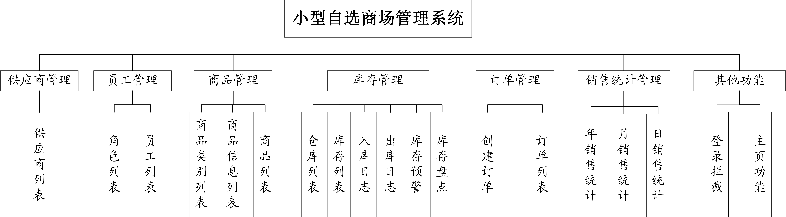

# market-manage-system

软件工程师综合训练项目-自选商场管理系统。

**日期**：2020年10月

## 题目要求

设计并开发一个小型自选商场管理系统，需要涉及员工信息、商品信息、商品类别、库存信息、商品入库、商品出库、供应商信息、盘亏（盈）、商品价格信息、折扣信息、销售明细、应付款信息等实体。

## 技术说明

+ 前端：基于[x-admin](http://x.xuebingsi.com/)后台模板开发，基于layui开发
+ 后端：基于SpringBoot开发，使用了SSM框架。
+ 数据库：SQL Server 2008.

## 版本说明

+ 前端框架：Layui 2.4.5

+ SpringBoot 版本：2.3.3.RELEASE

+ Spring 版本：5.2.8.RELEASE
+ JAVA 版本：1.8.0_231

## 系统结构

## 运行示例

